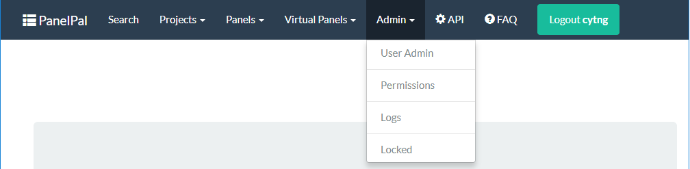
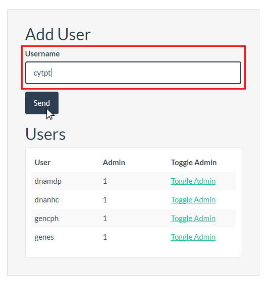
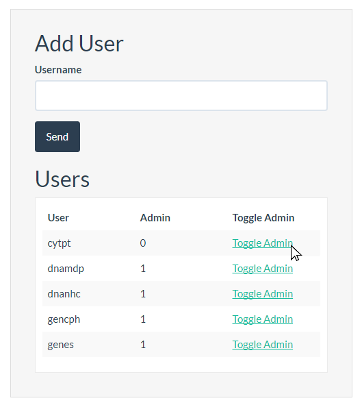
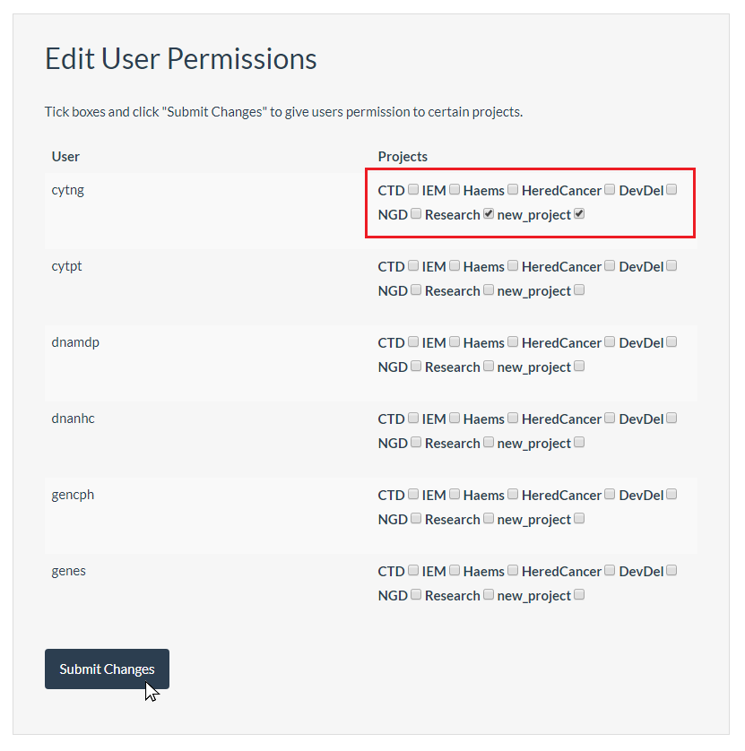
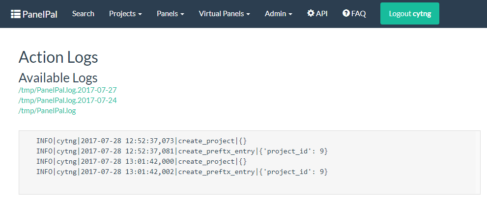
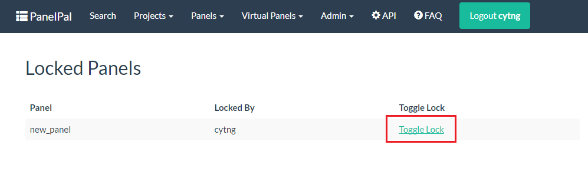

*****
Admin
*****

There are several functions that are available to admin users. If you have admin privileges, you will see the admin
button in the nav-bar

|

|

Each of the functions in the drop-down will be explained below.

User admin
==========

The user admin page allows admin members to add users and allow admin privileges. To add a new user, type their windows
username into the box and click the "Send" button.

|

|

To change someones admin permissions, click the "Toggle Admin" link next to their username

|

|

Permissions
===========

Admin members can add or remove other users from projects. To change a users permissions, go to the permissions page and
check or uncheck the relevant boxes next to the username, then click "Submit Changes".

|

|

Logs
====

PanelPal creates logs for each modification made to the database. These can be viewed on the logs page.

|

|

The default is to display the current log for the day. If you want to view a log from a previous day, select it from the
links at the top of the page.

Locked panels
=============

Admin users can unlock panels regardless of who ahs locked them. If a panel is locked and the user is not available to
unlock the panel an admin user can go to the locked panels page through the admin menu.

To unlock a panel, click the "Toggle Lock" link next to the relevant panel.

|

|

