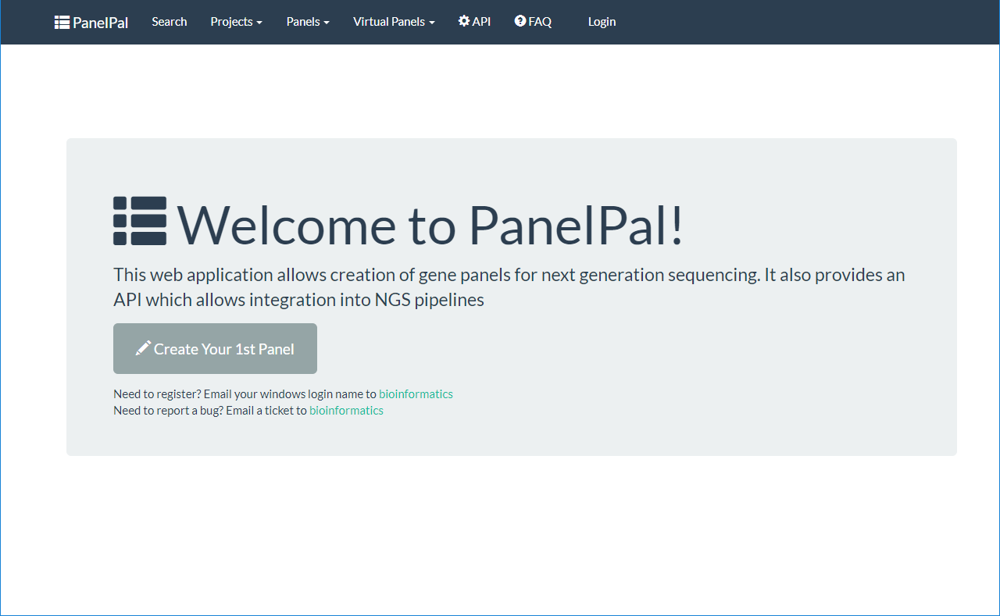
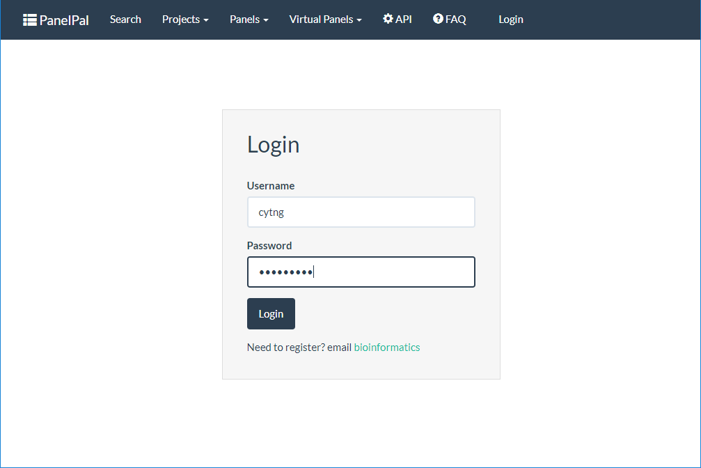
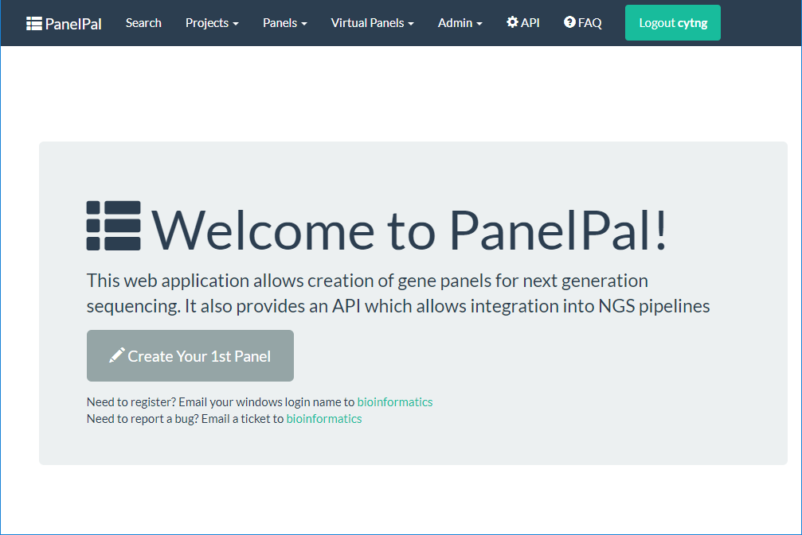

********
Homepage
********

To access PanelPal go to http://panelpal.sch.nhs.uk/ on your browser.

The page you will see when you first navigate to PanelPal is shown below. From here you can do a number of things:

* Login
* Search PanelPal
* View or create projects, panels or virtual panels
* View and test the API
* Visit the FAQ page

If you have admin privileges you will also be able to see this option in the navigation bar.

******
Login
******

In order to access the information held within PanelPal, you need to be registered as a user. If you have not used
PanelPal before or are unable to login, please `email`_ with your windows username.

.. _email: mailto:matthewparker24+lzj6vkpuibpnivi6nsog@boards.trello.com?Subject=#PanelPal%20#registration%20New%20login

To login to PanelPal, click the login button in the navigation bar.

.. image:: ../images/nav_bar_login.png

Use your windows username and password to access the system.

You will then be redirected to the homepage and see a green button in the navbar. This button can be used to logout of
PanelPal.

