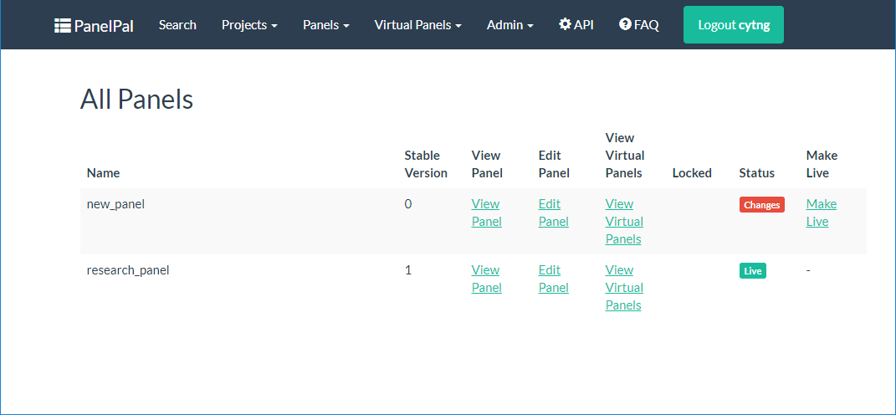

******
Panels
******

To view or create a panel, click the panels button in the nav-bar and select the option you require. This menu also
contains a "Manage Locked Panels" option which will be explained :ref:`below <locked-panels>`.

|

.. image:: ../images/panels_menu.PNG

.. _create-or-edit:

Create and Edit a Panel
=======================

If you are editing a panel, it follows the same workflow described below. The only differences are:

* The project and panel name will already be populated (and disabled)
* The genes that are in the panel will be available on the :ref:`regions <regions>` page
* Regions that have been added will be selected when the gene is viewed
* Any existing extensions will be added to the regions
* Custom regions that have been created for the panel will be listed on the :ref:`custom regions <custom-regions>` page

**N.B.** The regions that will be selected in the edit stage will be those that are in the highest version number for
the panel. This means that any changes that have already been made in the :ref:`\"upcoming\" <upcoming>` panel will be
displayed.

Panel Name
----------

To create a new panel, select the correct project from the drop-down, enter the panel name in the box and click next. If
you have not made a project yet, :ref:`add one <create-project>` in the projects section of PanelPal.

|

|

|

If the panel name exists or if one or more of the fields are left blank, a warning will be displayed. This error must be
corrected before you can continue.

|

Genes
-----

If the panel is created successfully, you will move to the "Genes" tab. Each gene needs to be added to the panel. This
can either be done by entering the name of the gene in the box or by uploading a file of gene names.

When adding gene names individually, an auto-fill drop-down will appear as you type the gene name. If you click on an
entry in the list, it will complete the gene name in the box with the selected option. Once the gene name has been
filled in, click "Add".

|

|

When a file is to be used, click the "Browse" button (blue box) to open up the windows explorer menu. Browse to and select
the file that is to be used; it will then appear in the box. Once the file has been selected, click "Upload" (red box).
**N.B.** the file must be one gene per line.

|

|

When the genes have been added, a success message will be displayed. If there are any problems with the entry a warning
message will be displayed. This is likely to occur if you are using a legacy name for a gene. If a warning message is
displayed, please check the spelling and current HGNC gene name before contacting the `bioinformatics`_ team.

.. _bioinformatics: mailto:matthewparker24+lzj6vkpuibpnivi6nsog@boards.trello.com?Subject=#PanelPal%20%20Gene%20error

|

|

Transcripts
-----------

Once the genes have been added, click next to select the preferred transcripts. If a preferred transcript has already
been added for a gene within the project or there is an :ref:`\"upcoming\" <upcoming>` preferred transcript, these will
be indicated in the drop-down.

Unless they have already been :ref:`added for the project <pref-tx>`, you need to select the preferred transcript for
each gene within the panel. **There is no default selection** so whatever value appears first will be the transcript
that is added for that gene if no selection is made.

To select a preferred transcript, choose the correct accession number from the drop-down for each gene. These will be
added to the database when the regions are selected in the next stage of the workflow.

|

|

Once all the transcripts have been checked and selected, click next to move onto region selection.

.. _regions:

Regions
-------

Add regions
^^^^^^^^^^^

The regions page displays all the genes that have currently been added to the panel.

|

|

If a gene is red, it means no regions from that gene have been added to the panel. Once regions have been added, the
button will become green.

|

|

To view the regions for a gene, click on the button with the correct gene name. This will display the regions in a table
below the gene list.

|

|

To add a region, click the slider (red box) at the end of the row for the corresponding region. If all regions are to be
added, you can click the "Select All" slider (blue box).

Once at least one region has been selected, you can click "Add Regions" (red arrow) to add them to the database. If the
gene is no longer required for the panel, click "Remove Gene" (blue arrow). This will remove the gene from the database
and the list at the top of the page.

**N.B.** If a gene is removed from a panel, it will also be removed from all virtual panels but these changes will not
be made live.

|

|

UTR
^^^

The default is to exclude the UTR from the panel. If the UTR is to be included, you can alter the co-ordinates for the
gene by clicking the "Include UTR" checkbox.

|

|

.. image:: ../images/create_panel_regions_UTR.PNG

|

If the gene has already been added to the panel but you would now like to include the UTR, the regions that have changed
will be highlighted in red.

If the co-ordinates for **either** the start or end have been changed, the region will need to be saved or discarded
using the buttons at the right of the row (red box). If the region is a non-coding exon **both** of the co-ordinates
will appear red. To add these the the panel you need to click the "Add Regions" button.

|

|

Changing co-ordinates
^^^^^^^^^^^^^^^^^^^^^

If you would like to extend the region to include more of the intron or some of the UTR, you can edit the co-ordinates
manually.

Click inside the co-ordinate you would like to change and edit the value to include the extension. **N.B.** the regions
displayed do not include the +/- 5 or 25 bp that will be added for the diagnostic pipeline. These will be added when the
BED file is exported for use.

If the region has not yet been added to the panel, edit the co-ordinate and then click the slider for each of the
regions to be included (or "Select All") as described above before clicking "Add Regions".

If the region has already been added to the panel, when you click the co-ordinates box, the slider will be replaced by
two buttons.Once you have changed the value, click the save button at the right hand side of the row (red arrow). If you
want to discard your changes click the remove button (blue arrow).

|

|

Add all
^^^^^^^

If there are a large number of genes to be added and the default settings are appropriate (add all regions, excluding
UTR and no extensions), the "Add All" button can be used. This will go through each gene in turn and add it to the
panel.

|

|

It is possible to edit the genes to include the UTR or extensions, as well as remove regions, after the "Add All"
button has been used. Equally, the genes that do not require default settings can be added first and the "Add All"
button used to add the remaining genes.

Once clicked, a progress bar will be shown below the gene list.

|

|

.. _custom-regions:

Add custom regions
^^^^^^^^^^^^^^^^^^

It is also possible to add custom regions to the panel. These are regions that are not an exon within the current
database. For example, an intronic region that covers a specific reported mutation.

To view the current custom regions or add a new region to a panel, click the "Custom Regions" button at the beginning
of the gene list.

|

|

This will display the current custom regions for the panel. To add a new custom region click the "Create Custom Region"
button.

|

|

This will display a series of boxes that must be filled in to add the region to the panel:

* Chromosome: select the correct value from the drop-down
* Start position: enter the genomic co-ordinate for the start of the region
* End position: enter the genomic co-ordinate for the end of the region
* Region name: enter a descriptive name for the region, preferably beginning with the gene name. **DO NOT INCLUDE SPECIAL CHARACTERS**

**N.B.** Co-ordinates must be in the zero-based, half-open format. See the PanelPal FAQ page for more information about
this.

|

|

Once the values have been entered, click "Add". This will add the region to the panel and display the updated custom
regions table.

|

|

Once all the genes and the custom regions have been added, click next to move to the final step of the workflow.

Complete the workflow
---------------------

When the panel is complete, the final step requires you to define whether or not the panel is
:ref:`\"made live\" <make-live>`. If a panel is made live it means it is available for use within the diagnostic
pipeline.

If the panel requires further additions and editing, leave the default "No" option selected. This will leave the panel
in "draft" until it is ready to be put into service. If the panel is ready for use, select "Yes". Once the correct
option has been selected click the "Done!" button to complete the workflow.

|

|

Once you click "Done!" it will redirect you to the panel view page.

View Panels
===========

.. _view-panels:

View all panels
---------------

The view panels page accessed from the nav-bar will show you all of the panels within PanelPal. If you have accessed
this page from a :ref:`project <view-project>` link, it will only display the panels within that project.

The options available from this page will depend on which projects you have permission to work on. From the view panels
page, you can view and edit the panel, view the virtual panels and :ref:`\"make live\" <make-live>`.

The view panels page also details the current ("stable") version and whether the panel is locked or if it has changes
that have not been :ref:`\"made live\" <make-live>`. If the panel has no :ref:`\"upcoming\" <upcoming>` regions, the
status will say "Live". If there are changes to be made to the panel in the next version, it will say "Changes" and the
"Make Live" link will be available if you have edit permissions.

|

|

If a panel is :ref:`locked <locked-panels>` a padlock symbol will appear in the locked column.

|

|

To find out who has locked the panel, hover the mouse over the padlock.

|

|

Panel viewer
------------

The panel view displays the current regions in the panel. The default is to display the first 10 rows of the panel; the
total number of rows is displayed at the bottom of the table.

|

|

You can either navigate through the pages to view the rest of the panel, or change the number of rows that are
displayed.

|

|

|

If you are looking for a particular element of the panel, you can use the search box. The term entered in the box can be
anything from within the table. Therefore, it is possible to search by gene, chromosome, position or region name.

|

|

The total number of rows will give the number for the current search. The total number of rows for the panel will be
listed in brackets.

|

|

.. _view-versions:

Viewing a previous version
^^^^^^^^^^^^^^^^^^^^^^^^^^

The default for the panel view page is the current live version. If there are changes that have not been
:ref:`\"made live\" <make-live>` yet, a message will be displayed at the top of the page. The changes cannot be viewed
on this page until they are included in a live version of the panel.

For a description of version numbers, see the :ref:`intro <versions>` page

|

|

If there are previous versions of the panel, these can be viewed by selecting the appropriate version from the drop-down
and clicking "Go". This will refresh the page and show the selected version.

|

|

Download a panel
^^^^^^^^^^^^^^^^

If a text file copy of the panel is required, it can be downloaded from the view panels page. There are three options
for download:

* **.bed** - This is a file containing the raw regions for the panel. Overlapping regions are merged and the file is
  sorted by start position. Only the extensions that have been added at the design stage are included.
* **.bed +/- 25 bp** - This is the same as above but all regions (other than custom regions) have 25 bp added on either
  side.
* **design file** - This is a comma delimited file that can be uploaded to Agilent panel design software for probe
  development. The regions in this file are also merged and sorted.

|

|

Clicking one of the options in the list will download a text file to your computer. The file will be named in the
following format:

*<panel name>*\ (_25bp)_v\ *<version number>*\ _\ *<username>*\ _\ *<day-month-year>*\ .bed

**N.B.** Design files will end with '.txt' and '_25bp' is only included where extensions have been added.

To download a previous version, :ref:`view the version <view-versions>` and then use the download button as described above.

.. _locked-panels:

Locked Panels
==============

If a panel is locked it cannot be :ref:`edited <create-or-edit>` or :ref:`\"made live\" <make-live>` by anyone other
than the user who has locked the panel. This is to prevent changes being made by two different people at the same time
or a panel being put into service when it has not been completed.

If a :ref:`virtual panel <virtual-panels>` is being edited, the parent panel is locked. This is to prevent regions being
removed from the parent panel when they are being added to a virtual panel. Conversely, if a panel is locked, all the
virtual panels will be locked to prevent genes being added to virtual panels when they are being removed from the parent
panel.

When you leave the edit page, the panel should be unlocked. If for some reason a panel remains locked, go to the
"Manage Locked Panels" page.

|

.. image:: ../images/panels_menu_locked.png

|

This page will list any panels that are currently locked with your username. You can unlock the panel by clicking
"Toggle lock".

|

.. image:: ../images/panels_togglelock.PNG

|

If a panel is locked by another user and they are unable to unlock this, speak to an admin user to unlock the panel
for you.

