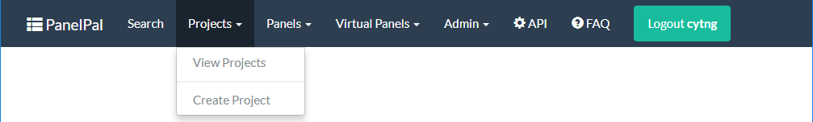
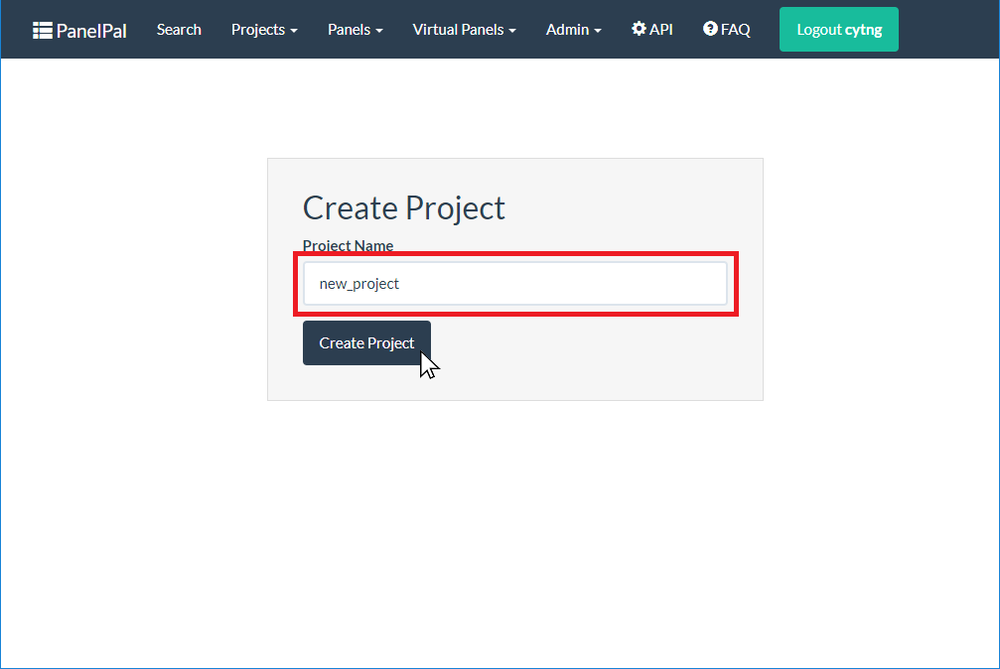
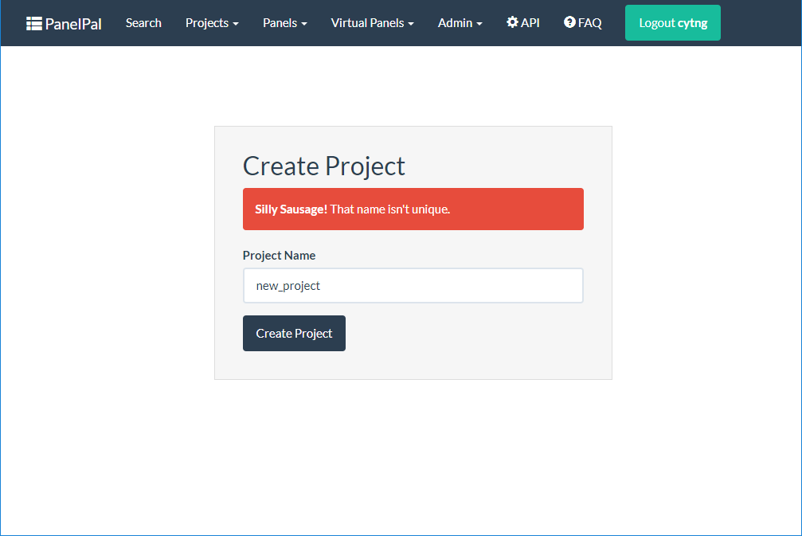
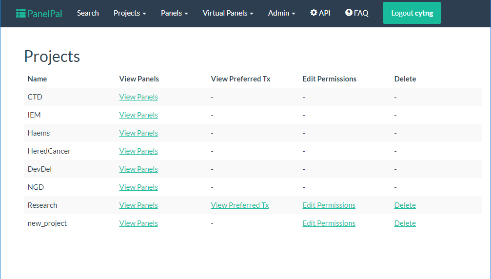
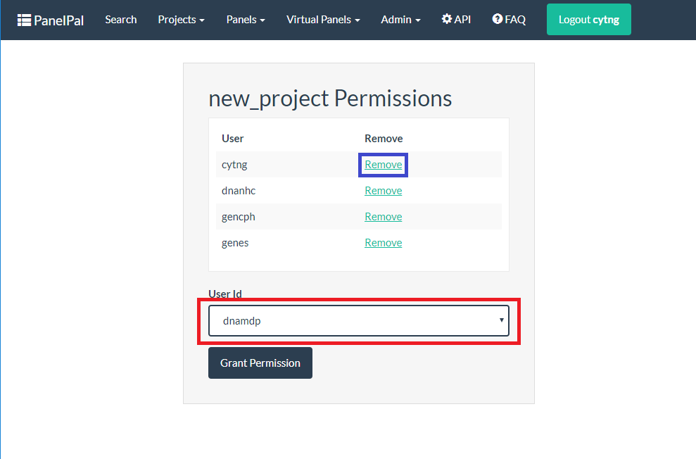
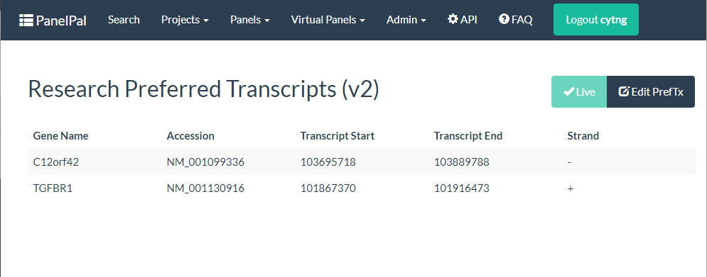
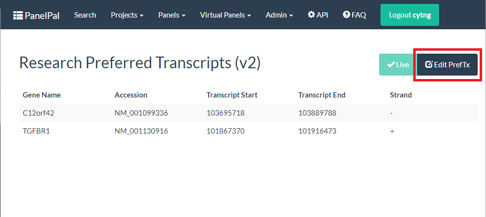
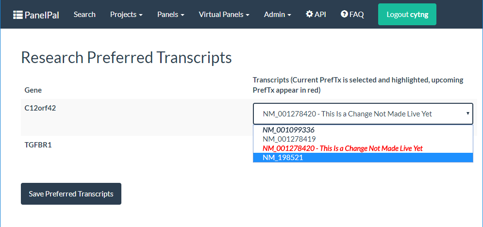
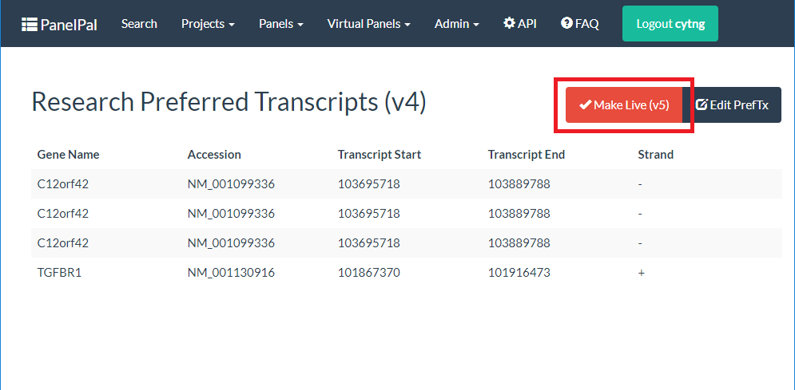

*********
Projects
*********

To view or create a project, click the projects button in the nav-bar and select the option you require.

.. _create-project:

Create a Project
=================

To create a project, write the project name in the box and click create project.

|

|

If there is already a project with that name, a warning will be displayed. Either use the existing project or choose a
different project name.

|

|

If the project is created successfully, you will be redirected to the view projects page.

.. _view-project:

View Projects
==============

The view projects page will show you all of the projects within PanelPal. The options available from this page will
depend on which projects you have permission to work on. From the view projects page, you can view panels and preferred
transcripts. You can also edit the permissions for the project from this page, provided you are a member of the project.

|

Permissions
============

If you are a member of a project, you can add or remove other members of staff. To remove a member, simply click the
link next to the correct username (blue box). To add a new member, select the correct username from the drop-down (red
box) and click "Grant Permission".

|

.. _pref-tx:

Preferred Transcripts
======================

View
----

To view the current preferred transcripts for a project, click the preferred transcripts link for the project in the
view projects page. This will display a list of the transcripts associated with each gene in the project.

|

Edit
----

From the view preferred transcripts page you can navigate to the edit page.

|

|

Once on the edit page, you can change the transcript associated with each gene by clicking the drop down and selecting
the new transcript. **N.B.** the current preferred transcript will be in bold and italics.

If changes have been made to the preferred transcripts but they have not been :ref:`\"made live\" <make-live>` they will appear as red in the
drop-down list.

Once you have changed all the transcripts that need to be updated, click "Save Preferred Transcripts".

|

|

This will take you back to the view preferred transcripts page. There will now be a red :ref:`\"make live\" <make-live>` button next to edit.
If you click this button it will produce a new live version of the preferred transcripts and the changes you made will
be put into service. **Only click this if you are happy with all the changes that have been made** as the new preferred
transcripts will be used immediately by the diagnostic pipeline.

|

