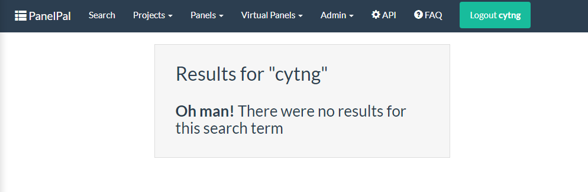

******
Search
******

All the tables in the PanelPal databased can be searched to find certain information. To access the search page, click
the "Search" button in teh nav-bar.

|

|

To carry out a search, first select the type of search from the drop-down. this refers to the table that the search term
will be found in. for example, if you want to find out which panels contain BRCA1, select the "Gene" search type from
the drop-down.

|

|

Once you have selected the search type, enter the term into the box below. This will autocomplete once you start to
type the term you wish to search for. You can select from the autocomplete list by clicking on the correct term.

|

|

When you have entered the search term, click the search button to retrieve the results.

|

|

The results presented will depend on the search. If you have searched for a gene, the transcripts for that gene and
the panels and virtual panels it is present in will be displayed.

|

|

Results for the other search types are shown below:

* **Transcript:** The results will show the gene the transcript belongs to and any panels that the gene is present in

* **Panel:** The results will show a link to the panel, the project the panel belongs to and any virtual panels it has. The
  results will also show all users that have permission to edit the panel and the genes within the panel.

* **Virtual Panel:** The results will show a link to the virtual panel, the project and the panel that the virtual panel belongs to. The
  results will also show all users that have permission to edit the panel and the genes within the virtual panel.

* **Project:** The results will show a link to the project and all the panels and virtual panels it contains. The results
  will also show users with edit permission.

* **User:** The results will show all the projects that the user has edit permissions for.

If the search term does not return any results a message will be displayed

|

|

