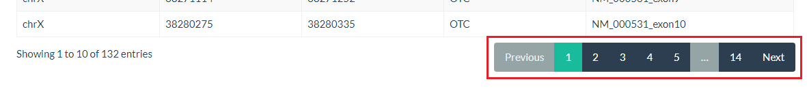

.. _virtual-panels:

**************
Virtual Panels
**************

To view or create a virtual panel, click the panels button in the nav-bar and select the option you require.

|

|

Create and Edit a Virtual Panel
================================

If you are editing a panel, it follows the same workflow described below. The only differences are:

* The panel and virtual panel name will already be populated (and disabled)
* The genes that are in the virtual panel will be selected (and disabled) on the :ref:`genes <vp-genes>` page available
  on the :ref:`regions <vp-regions>` page
* Regions that have been added will be selected when the gene is viewed. This also includes
  :ref:`custom regions <vp-custom-regions>`.

**N.B.** The regions that will be selected in the edit stage will be those that are in the highest version number for
the panel. This means that any changes that have already been made in the :ref:`\"upcoming\" <upcoming>` panel will be
displayed.

Virtual Panel Name
------------------
To create a new virtual panel, select the correct parent panel from the drop-down, enter the virtual panel name in the
box and click next. If you have not made a panel yet, :ref:`add one <create-or-edit>` in the panels section of
PanelPal.

**N.B.** Panels that are locked will not appear in the drop-down.

|

|

|

If the virtual panel name exists or if one or more of the fields are left blank, a warning will be displayed. This error must be
corrected before you can continue.

|

|

.. _vp-genes:

Genes
-----

Once the panel has been created successfully, you will move to the "Genes" tab. All the genes contained within the
parent panel will appear in a list. To add a gene to the virtual panel, click the slider to right of the gene name (red
box). Alternatively, use the "Select All" slider (blue box) to add all available genes to the virtual panel.

**N.B.** Genes and regions that have not been :ref:`\"made live\" <make-live>` will not be available for the virtual
panel.

|

.. image:: ../images/create_vpanel_genes.PNG

|

Once a gene has been selected it will appear in the list on the :ref:`\"Regions\" <vp-regions>` tab. When all the
required genes have been selected, click next to move to the "Regions" tab.

.. _vp-regions:

Regions
-------

Add regions
^^^^^^^^^^^

The regions page displays all the genes that have currently been added to the virtual panel.

|

|

If a gene is red, it means no regions from that gene have been added to the virtual panel. Once regions have been added,
the button will become green.

|

|

To view the regions for a gene, click on the button with the correct gene name. This will display the regions in a table
below the gene list.

**N.B.** Only regions that have been added to the parent panel will be shown.

|

|

To add a region, click the slider (red box) at the end of the row for the corresponding region. If all regions are to be
added, you can click the "Select All" slider (blue box).

Once at least one region has been selected, you can click "Add Regions" (red arrow) to add them to the database. If the
gene is no longer required for the panel, click "Remove Gene" (blue arrow). This will remove the gene from the database
and the list at the top of the page.

|

|

It should be noted that region co-ordinates cannot be edited in a virtual panel. The extensions will also be included in
all virtual panels that include an altered region.

Add all
^^^^^^^

If all the regions for each gene are to be added to the virtual panel, the "Add All" button can be used. This will go
through each gene in turn and add it to the panel.

|

|

It is possible to edit the regions that have been included, after the "Add All" button has been used. Equally, the genes
that do not require all regions can be added first and the "Add All" button used to add the remaining genes.

Once clicked, a progress bar will be shown below the gene list.

|

|

.. _vp-custom-regions:

Add custom regions
^^^^^^^^^^^^^^^^^^

As well as selecting regions within genes for the virtual panel, it is also possible to select custom regions included
within the parent panel.

Adding custom regions follows the same process as described above. To view the available custom regions, click the
"Custom Regions" button at the beginning of the gene list.

|

|

Complete the workflow
---------------------

When the virtual panel is complete, the final step requires you to define whether or not the panel is
:ref:`\"made live\" <make-live>`. If a virtual panel is made live it means it is available for use within the diagnostic
pipeline.

If the virtual panel requires further additions and editing, leave the default "No" option selected. This will leave the panel
in "draft" until it is ready to be put into service. If the panel is ready for use, select "Yes". Once the correct
option has been selected click the "Done!" button to complete the workflow.

|

|

Once you click "Done!" it will redirect you to the virtual panel view page.

View Virtual Panels
===================

View all virtual panels
-----------------------

The view virtual panels page accessed from the nav-bar will show you all of the virtual panels within PanelPal. If you
have accessed this page from a :ref:`panel <view-panels>` link, it will only display the virtual panels within that
panel.

The options available from this page will depend on which projects you have permission to work on. From the view virtual
panels page, you can view and edit the virtual panel, and :ref:`\"make live\" <make-live>`.

The view virtual panels page also details the current ("stable") version and whether the virtual panel is locked or if
it has changes that have not been :ref:`\"made live\" <make-live>`. If the panel has no :ref:`\"upcoming\" <upcoming>`
regions, the status will say "Live". If there are changes to be made to the panel in the next version, it will say
"Changes" and the "Make Live" link will be available if you have edit permissions.

|

|

If a virtual panel is :ref:`locked <locked-vpanels>` a padlock symbol will appear in the locked column.

|

|

To find out who has locked the panel, hover the mouse over the padlock.

|

|

Virtual panel viewer
--------------------

The virtual panel view displays the current regions in the virtual panel. The default is to display the first 10 regions
of the panel; the total number of rows is displayed at the bottom of the table.

|

|

You can either navigate through the pages to view the rest of the regions, or change the number of rows that are
displayed.

|

|

|

If you are looking for a particular element of the virtual panel, you can use the search box. The term entered in the
box can be anything from within the table. Therefore, it is possible to search by gene, chromosome, position or region
name.

|

|

The total number of rows will give the number for the current search. The total number of rows for the virtual panel
will be listed in brackets.

|

|

.. _view-versions-vpanel:

Viewing a previous version
^^^^^^^^^^^^^^^^^^^^^^^^^^

The default for the virtual panel view page is the current live version. If there are changes that have not been
:ref:`\"made live\" <make-live>` yet, a message will be displayed at the top of the page. The changes cannot be viewed
on this page until they are included in a live version of the panel.

For a description of version numbers, see the :ref:`intro <versions>` page

|

|

If there are previous versions of the panel, these can be viewed by selecting the appropriate version from the drop-down
and clicking "Go". This will refresh the page and show the selected version.

|

|

Download a virtual panel
^^^^^^^^^^^^^^^^^^^^^^^^

If a text file copy of the panel is required, it can be downloaded from the view panels page. There are three options
for download:

* **.bed** - This is a file containing the raw regions for the panel. Overlapping regions are merged and the file is
  sorted by start position. Only the extensions that have been added at the design stage are included.
* **.bed +/- 25 bp** - This is the same as above but all regions (other than custom regions) have 25 bp added on either
  side.
* **design file** - This is a comma delimited file that can be uploaded to Agilent panel design software for probe
  development. The regions in this file are also merged and sorted.

|

|

Clicking one of the options in the list will download a text file to your computer. The file will be named in the
following format:

*<panel name>*\ (_25bp)_v\ *<version number>*\ _\ *<username>*\ _\ *<day-month-year>*\ .bed

**N.B.** Design files will end with '.txt' and '_25bp' is only included where extensions have been added.

To download a previous version, :ref:`view the version <view-versions-vpanel>` and then use the download button as
described above.

.. _locked-vpanels:

Locked Panels
==============

If a virtual panel is locked it cannot be :ref:`edited <create-or-edit>` or :ref:`\"made live\" <make-live>` by anyone
other than the user who has locked it. This is to prevent changes being made by two different people at the same time
or a virtual panel being put into service when it has not been completed.

If a :ref:`virtual panel <virtual-panels>` is being edited, the parent panel is locked. This is to prevent regions being
removed from the parent panel when they are being added to a virtual panel. Conversely, if a panel is locked, all the
virtual panels will be locked to prevent genes being added to virtual panels when they are being removed from the parent
panel.

When you leave the virtual panel edit page, the parent panel should be unlocked. If for some reason a panel remains
locked, go to the "Manage Locked Panels" page.

|

|

This page will list any panels that are currently locked with your username. You can unlock the panel by clicking
"Toggle lock".

|

|

If a panel is locked by another user and they are unable to unlock this, speak to an admin user to unlock the panel
for you.

